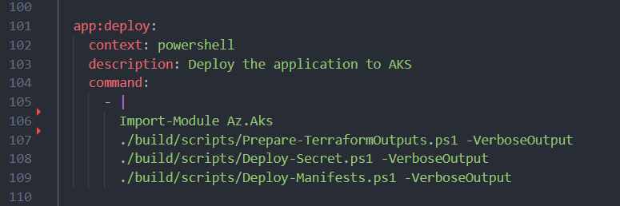

=== Deploy

==== [.underline]*Contextual Overview*
This task utilises a few scripts to keep the taskctl tasks simple and easy to read. The scripts are located within the `root/build/scripts` directory and contain various supporting scripts for the deployment task as well as others.

.Application Deploy Task

The scripts it calls to are:

- *_Prepare-TerraformOutputs_* - a script to remove the logic of fetching terraform outputs from state or via terraform init/plans
- *_Deploy-Secret_* - This ensures that a secret is deployed to the K8s cluster ONLY if the `$create_redis` variable has been set to true
- *_Deploy-Manifests_* - This deploys standard K8s manifests to the K8s cluster to deploy a simple frontend application, using the image generated in the step above. These manifests can be located in `root/deploy/app` and will need you to tweak their content to ensure that the correct endpoint is exposed via ingress, as well as the correct image is used for the deployment.

Each of the above scripts will use environment variables which SHOULD be present within your terminal session, or dictated by your `root/build/azDevOps/azure/pipeline-vars.yml` variable delcarations within your pipeline. Ensure you are passing the correct environment variables into this task at the `deploy-infrastructure.yml` level or the environment variables will not exist.
