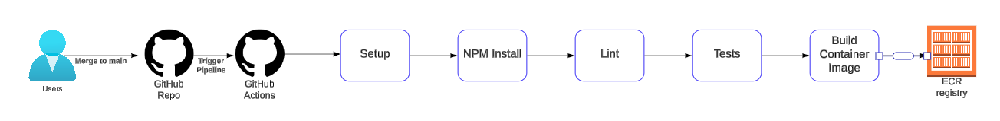
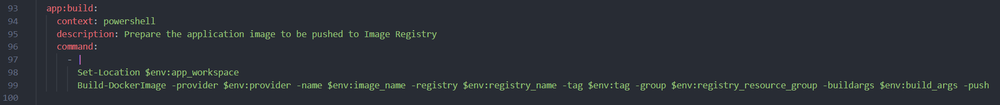
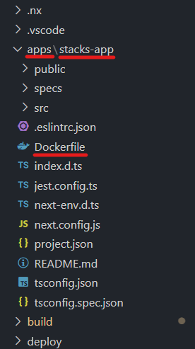

== Application Install NPM, Lint, Tests, Local Build, Build
.Application BuildApp Full Process Overview


=== NPM Install
This is required to be able to run application linting and testing against the application. It cannot test or lint without these requirements.

=== Lint
The Linting stage simply checks current scope application code against linting standards. If your code is not correct, the pipeline will fail and outline the failures to correct. 

=== Tests
Testing utilizes Jest, running pre-defined tests against the application in deployment scope. These tests can be written & updated as more code is added to the solution.

===  Build Container Image
==== [.underline]*Contextual Overview*
This is a simple build stage with a few processes, the code looking like the following:

.Application Build Task


The build directories set out within the `root/.github/workflows/ci.yml` will show you the default expected build arguments, for a project that looks like this:

```
build_args: -f ./apps/stacks-app/Dockerfile
```

.Example source code for application build


==== [.underline]*Process to Build*

Using Taskctl to direct to tasks and its underlying Ensono Independent Runner PowerShell modules, the process to build simply requires a few input variables to perform a basic build. This will call to your *Elastic Container Registry* (*ECR*), or *Docker Registry* (*DR*). It will perform a login using your authentication credentials, and then Docker Build, Tag and Push to your desired endpoint, publishing your application image. This will then be referenced in the following Deploy Step/Task.
