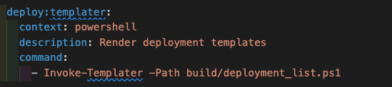
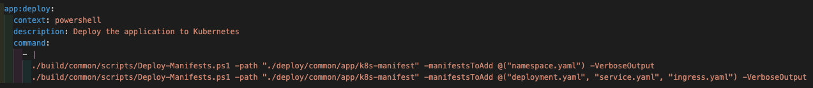

=== Deploy

==== [.underline]*Contextual Overview*
This task utilises a few scripts to keep the taskctl tasks simple and easy to read. The scripts are located within the `root/build/common/scripts` directory and contain various supporting scripts for the deployment task as well as others.

.Application Templater Task

.Application Deploy Task

These tasks will call the following scripts:

- *_Invoke-Templater_* - This will replace any placeholders in files using the values from matching environment variables or the values specified in the deployment list. The deployment list used is located at `root/build/deployment_list.ps1`. 
- *_Deploy-Manifests_* - This deploys standard K8s manifests to the K8s cluster to deploy a simple frontend application, using the image generated in the step above. These manifests can be located in `root/deploy/common/app/k8s-manifest`. 

Each of the above scripts will use environment variables which SHOULD be present within your terminal session, or dictated by your `root/.github/workflows/ci.env` file or directly within the GHA workflow file (`root/.github/workflows/ci.yml`).
