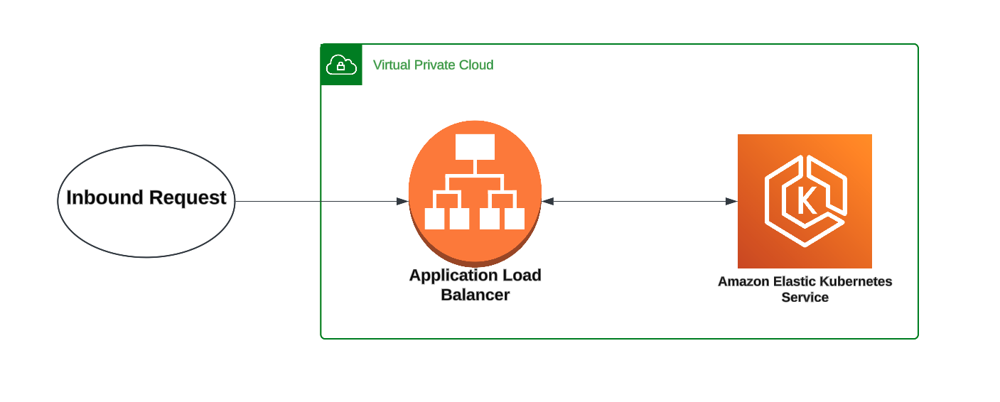

== Infrastructure

All of the infrastructure that is deployed to AWS, is done using Terraform. For Stacks NX the core infrastructure is deployed using the Ensono Digital EKS module as found in the https://github.com/Ensono/stacks-infrastructure-eks repository.

The following diagram depicts the resources that are deployed.

.AWS Resourses for the NX application.

